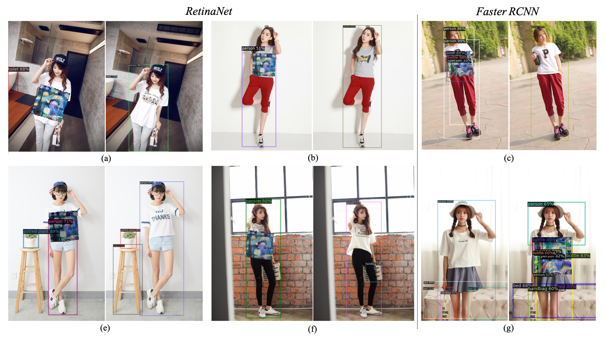

# [Fooling-Object-Detection-Network](https://github.com/neet-cv/Fooling-Object-Detection-Network)

This repo is about using adversarial patches to attack popular object detections.

## Some Results

## Attention !

Since our paper has not yet been accepted, we will publish the complete code after the paper has been accepted.

